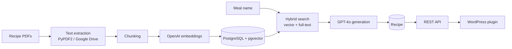

# AI Cooking App

[](https://github.com/lukasz-segin/ai-cooking-app/actions/workflows/ci.yml)

Django REST API with RAG over recipe PDFs: pgvector hybrid search, GPT-4o recipe generation and WordPress publishing.

The app takes a library of recipe PDFs and turns it into a searchable knowledge base. It uses that knowledge base to write new recipes that are ready to publish.

## What it does

- **PDF ingestion.** Text is extracted with PyPDF2 or through Google Drive conversion (batched for large files), split into chunks and embedded with OpenAI `text-embedding-3-small`. Chunks are stored in PostgreSQL with pgvector.
- **Hybrid search.** pgvector cosine similarity is combined with PostgreSQL full-text search. When keywords find nothing, the search falls back to semantic-only.
- **RAG recipe generation.** The app retrieves chunks similar to a meal name and asks GPT-4o for a new structured recipe (ingredients, steps, nutrition), optionally with a DALL-E image. Prompts are versioned in `recipes/services/prompts.py`.
- **Safe to expose publicly.** Throttling per endpoint, a shared daily generation cap, admin-only write endpoints and a switch that turns generation off without a deploy.
- **WordPress publishing.** A custom plugin pulls generated recipes from the API into a WordPress recipe site as [WP Delicious](https://wordpress.org/plugins/delicious-recipes/) recipes (ingredients, steps, times, taxonomies, featured image), on an hourly schedule or on demand, and updates only recipes that changed.

## Architecture



| Path | What lives there |
| --- | --- |
| `documents_processor/` | Document models, PDF processing, chunking, embeddings, vector search |
| `recipes/` | Recipe model, search and generation endpoints, prompts |
| `ai_cooking_project/` | Settings, URLs, landing page, health check |
| `wordpress-plugins/fetch-recipes/` | WordPress plugin that imports recipes into WP Delicious ([README](wordpress-plugins/fetch-recipes/README.md)) |

## Tech stack

- **Backend:** Python 3.12, Django 5, Django REST Framework, drf-spectacular (OpenAPI)
- **Data:** PostgreSQL with pgvector, full-text search, Django database cache for throttling
- **AI:** OpenAI API (GPT-4o, `text-embedding-3-small`, DALL-E 3)
- **Infrastructure:** Docker, Gunicorn, WhiteNoise, GitHub Actions, Render + Neon (see [DEPLOY.md](DEPLOY.md))
- **Integration:** Google Drive API (optional), PHP WordPress plugin

## Quick start (Docker)

```bash
git clone https://github.com/lukasz-segin/ai-cooking-app.git
cd ai-cooking-app
cp .env.example .env          # set SECRET_KEY and OPENAI_API_KEY
docker compose -f docker-compose.local.yml up --build
docker compose -f docker-compose.local.yml exec web python manage.py createcachetable
docker compose -f docker-compose.local.yml exec web python manage.py createsuperuser
```

Compose starts PostgreSQL with pgvector and runs migrations on startup. Then open:

- http://localhost:8000/ for the landing page
- http://localhost:8000/api/docs/ for Swagger UI
- http://localhost:8000/admin/ for Django admin (documents, chunks, recipes)
- http://localhost:8000/healthz for the health check

A fresh checkout has no recipe data. Put your own PDFs in `documents/` and process them (see below) before search and generation return results.

To run without Docker, install PostgreSQL with the `vector` extension, then run `poetry install`, `poetry run python manage.py migrate`, `createcachetable` and `runserver`.

## API

Full interactive docs are at `/api/docs/` (schema at `/api/schema/`).

| Method | Endpoint | Access | Purpose |
| --- | --- | --- | --- |
| `GET` | `/api/recipes/` | public | List recipes |
| `POST` | `/api/recipes/` | staff | Create a recipe |
| `GET` | `/api/recipes/search/?meal_name=&limit=` | public, throttled | Hybrid search over document chunks |
| `POST` | `/api/recipes/generate/` | public, throttled + daily cap | Generate a new recipe with RAG |
| `GET` | `/api/documents/`, `/api/documents/{id}/` | staff | Processed documents and their status |
| `POST` | `/api/documents/process_document/` | staff | Process a PDF from `documents/` |
| `POST` | `/api/documents/process_with_google_drive_batched/` | staff | Process a large PDF in batches through Google Drive |
| `POST` | `/api/documents/process_drive_document/` | staff | Process a PDF already in Google Drive |

### Search

```bash
curl "http://localhost:8000/api/recipes/search/?meal_name=nocna%20owsianka&limit=3"
```

```json
{
  "query": "nocna owsianka",
  "results_count": 3,
  "results": [
    {
      "chunk_id": 1,
      "document_title": "Nocna owsianka.pdf",
      "content": "…",
      "vector_similarity": 0.9124,
      "text_match_score": 0.753,
      "combined_score": 0.7826,
      "search_method": "hybrid"
    }
  ]
}
```

### Generate a recipe

```bash
curl -X POST http://localhost:8000/api/recipes/generate/ \
     -H "Content-Type: application/json" \
     -d '{"query": "nocna owsianka z borówkami", "num_examples": 5}'
```

```json
{
  "status": "success",
  "recipe": {
    "id": 1,
    "title": "Nocna owsianka z borówkami",
    "description": "Pyszna i pożywna nocna owsianka z borówkami…",
    "instructions": "# Ingredients\n- 100 g płatków owsianych\n…\n# Instructions\n1. …",
    "image_url": ""
  },
  "similar_recipes_used": [
    { "document_title": "Nocna owsianka.pdf", "similarity_score": 0.5794 }
  ],
  "recipe_query": "nocna owsianka z borówkami"
}
```

Recipes are generated in Polish, and they use only ingredients and techniques from the retrieved examples. `num_examples` defaults to 3 (max 10).

## Security and cost limits

The generation endpoint calls a paid API, so the public API is locked down:

- Anyone can list recipes and call search or generate. Creating recipes and every document action require a staff user.
- Throttling per IP: `THROTTLE_SEARCH`, `THROTTLE_GENERATE`, plus `THROTTLE_ANON` / `THROTTLE_USER`. The limits are stored in the database cache, so all Gunicorn workers share them.
- `THROTTLE_GENERATE_DAILY_CAP` is one counter for the whole app, whoever is calling.
- `RECIPE_GENERATION_ENABLED=false` makes generation return HTTP 503 without calling OpenAI.
- `RECIPE_IMAGE_GENERATION_ENABLED` is off by default, so DALL-E only runs when you turn it on.
- Set `NUM_PROXIES` behind a reverse proxy so throttling uses the real client IP.

All settings are in [`.env.example`](.env.example) and are read by `SettingsFromEnvironment` in `ai_cooking_project/settings.py`. `SECRET_KEY` is required and must not be a `django-insecure-` value.

## Tests and CI

```bash
poetry run python manage.py test
```

GitHub Actions runs the test suite against PostgreSQL with pgvector on every push and pull request. A push to `master` deploys to Render only after the tests pass.

## Deployment

See [DEPLOY.md](DEPLOY.md) for the Render + Neon setup, secrets, cost controls and shutdown steps.

## Data

Cookbook PDFs and JSON fixtures are not part of this repository. Keep them locally in `documents/` or `private_data/` (both gitignored). Older commits still contain some of those fixtures. The history has not been rewritten.
