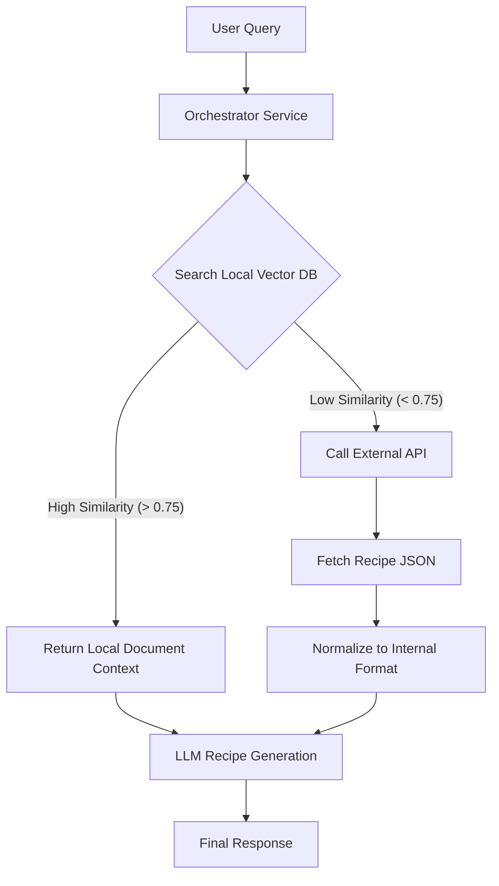

# Future Architecture: Hybrid Recipe Retrieval (RAG + External API)

## Overview
This document outlines a strategy to evolve the application from a pure "Curated Content" system (RAG only) to a "Hybrid Aggregator". The goal is to maintain the high quality/uniqueness of local documents (PDFs) while solving the "zero results" problem by falling back to external data sources when local knowledge is insufficient.

## The "Hybrid Fallback" Logic

[cite_start]Currently, the system relies solely on `VectorService` to find chunks in the `pgvector` database[cite: 3]. The proposed logic introduces a decision layer:

1.  **Primary Search (Local RAG):** Attempt to find recipes in the local PostgreSQL database using vector similarity.
2.  **Confidence Check:** Evaluate the `vector_similarity` score of the top result.
3.  **Fallback Trigger:** If the score is below a defined `THRESHOLD` (e.g., 0.75), trigger an external API search.
4.  **Normalization:** Standardize the external API response to match the internal `Recipe` model structure.
5.  **Synthesis:** Pass the data (local or external) to the OpenAI Service to generate the final response/image.

## Architecture Diagram



## Implementation Plan

### 1. New Service: `ExternalRecipeService`

Create a service in `recipes/services/` to handle external API communication.

* **Provider Candidates:**
* *Spoonacular API:* Robust food data, search by ingredients.
* *Edamam:* Good for nutrition analysis and recipe search.
* *TheMealDB:* Simple, free, open source (good for testing).


* **Responsibilities:**
* Fetch recipes by query string.
* Parse external JSON.
* Map external fields (ingredients, instructions) to our prompt format.


### 2. Update: `RecipeGenerationService` (Orchestrator)

Modify the logic that handles recipe generation queries.

**Pseudocode Logic:**

```python
# recipes/services/recipe_generator.py

def get_context_for_query(user_query: str):
    # 1. Try Local Search
    [cite_start]local_results = VectorService.search_similar(user_query, limit=3) # [cite: 3]
    
    top_score = local_results[0].similarity_score if local_results else 0
    CONFIDENCE_THRESHOLD = 0.75

    # 2. Decide Source
    if top_score >= CONFIDENCE_THRESHOLD:
        print("Using Local Documents (High Confidence)")
        return format_local_chunks(local_results)
    else:
        print("Local score low. Falling back to External API.")
        external_data = ExternalRecipeService.search(user_query)
        
        # Optional: Save this external recipe to DB for future caching?
        # save_external_recipe(external_data)
        
        return format_external_data(external_data)

```

### 3. Data Flow Changes

* 
**Current Flow:** `User -> API -> VectorService -> OpenAI -> Response` 


* **New Flow:** `User -> API -> DecisionEngine -> (VectorService OR ExternalService) -> OpenAI -> Response`

### 4. Pros & Cons of Implementation

* **Pros:**
* **User Retention:** Users never get "No results found."
* **Scalability:** Immediate access to millions of recipes without processing PDFs.
* **Differentiation:** Prioritizes your unique content (family recipes) first, using the internet only as a backup.


* **Cons:**
* **Latency:** External API calls might add latency.
* **Cost:** External APIs often have rate limits or subscription costs.
* **Consistency:** External data quality varies compared to curated PDFs.


## Next Steps to Prototype

1. Sign up for a free tier of Spoonacular or similar API.
2. Create `recipes/services/external_api_service.py`.
3. Add a generic switch in the search view to toggle `use_external_fallback=True`.
