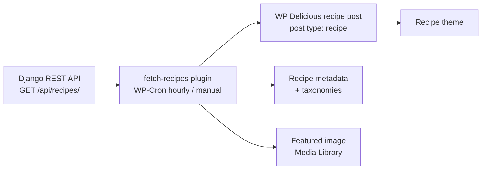

# Fetch Recipes from API (WP Delicious integration)

A custom WordPress plugin that consumes the AI Cooking App REST API and publishes the generated recipes on a WordPress recipe site. Recipes are stored in the format of the [WP Delicious](https://wordpress.org/plugins/delicious-recipes/) recipe plugin, so the site's recipe theme (for example Cook Recipe / Cookery Lite from BlossomThemes) shows them like any recipe added by hand.



## Features

- **Scheduled sync.** A WP-Cron event (`fr_fetch_recipes_event`) runs every hour. The first sync runs when the plugin is activated.
- **Manual sync.** **Tools → Fetch Recipes** has a "Fetch Recipes Now" button and shows the last and next run times.
- **WP Delicious mapping.** Each API recipe becomes a post of type `recipe` with WP Delicious metadata: subtitle, description, keywords, ingredients, steps, prep and cook time, calories, difficulty, best season and servings.
- **Taxonomies.** Course, cuisine, cooking method and recipe key from the API are assigned to the WP Delicious taxonomies (`recipe-course`, `recipe-cuisine`, `recipe-cooking-method`, `recipe-key`).
- **No duplicates.** Recipes are matched by the API id stored in post meta. An existing post is updated only when the API `updated_at` is newer than the stored one.
- **Featured image.** If the API returns `image_url`, the image is downloaded into the Media Library and set as the featured image.

## Requirements

- WordPress 5.0+ and PHP 7.4+
- [WP Delicious](https://wordpress.org/plugins/delicious-recipes/) installed and active (it registers the `recipe` post type and taxonomies)
- A running AI Cooking App API reachable from the WordPress server

## Installation

1. Copy or symlink this folder to `wp-content/plugins/fetch-recipes/`.
2. Set the API address in `fetch-recipes.php` (function `fr_fetch_and_create_recipes`). The default is:
   ```php
   $api_url = 'http://localhost:8000/api/recipes/';
   ```
3. Activate **Fetch Recipes from API (WP Delicious Integration)** in the WordPress admin. Activation schedules the hourly job and runs the first sync.

## How it works

1. **Fetch.** `GET` the recipe list from the API and decode the JSON array.
2. **Match.** Look for a `recipe` post (any status) whose `fr_recipe_id` meta equals the API `id`.
3. **Content.** The post body is the API `blog_content` (HTML). Older recipes without it fall back to `description`.
4. **Parse.** Ingredients and steps are parsed from the `# Ingredients` and `# Instructions` sections of `instructions`. `Prep Time:`, `Cook Time:` and `Calories:` lines are read when present.
5. **Save.** New recipes are created and published immediately. Existing ones are updated when the API version is newer.
6. **Metadata and taxonomies.** WP Delicious metadata, helper fields and taxonomy terms are written, together with the sync meta.
7. **Image.** The featured image is downloaded only if the post does not have one yet.

### API fields used

`id`, `title`, `subtitle`, `description`, `blog_content`, `instructions`, `keywords`, `difficulty`, `season`, `course`, `cuisine`, `cooking_methods`, `recipe_keys`, `image_url`, `updated_at`.

`course`, `cuisine`, `cooking_methods` and `recipe_keys` may be arrays or JSON-encoded strings; both are accepted.

### Post meta written

| Meta key | Purpose |
| --- | --- |
| `delicious_recipes_metadata` | Main WP Delicious recipe data |
| `_dr_difficulty_level`, `_dr_best_season` | Difficulty and season used by WP Delicious filters |
| `_dr_ingredient_count`, `_dr_recipe_ingredients` | Ingredient count and plain ingredient list |
| `_drwidgetsblocks_active` | Enables WP Delicious widgets and blocks for the post |
| `fr_recipe_id` | API recipe id (sync key) |
| `fr_recipe_updated_at` | API `updated_at` of the imported version |

## Defaults and limitations

- The API URL is hardcoded in `fetch-recipes.php`; there is no settings page yet.
- Requests use `sslverify => false` so a local API works. Set it to `true` for a production API with a valid certificate.
- Recipes are published straight away, without a review step.
- Missing values fall back to defaults: prep and cook time 15 min, 4 servings, difficulty "Łatwy", season "Cały rok".
- The featured image is set once; a changed `image_url` does not replace an existing image.
- Labels written into recipes are in Polish ("Składniki", "Sposób przygotowania").

## Logs

Progress and errors are written to the PHP error log with the `[FR]` prefix. Enable `WP_DEBUG_LOG` to collect them in `wp-content/debug.log`.
